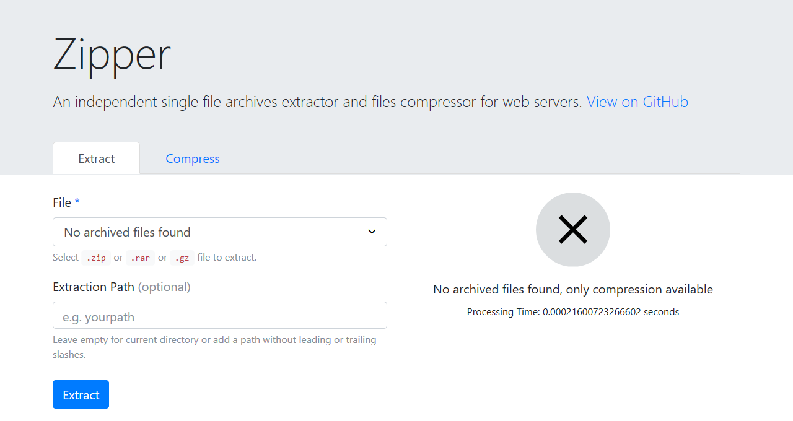
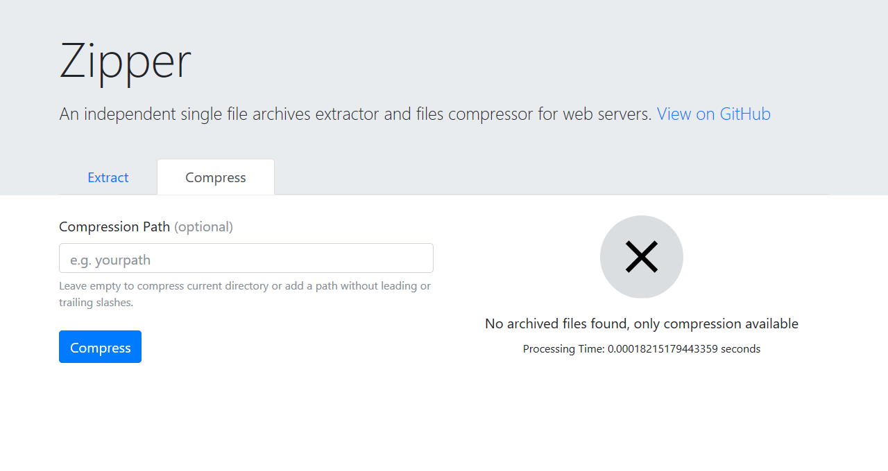

# Zipper

An independent single file archives extractor and files compressor for web servers.

Zipper detects archives and you choose which one to extract. You can also compress files to create archives.

## Supported Formats

- `.zip`
- `.rar`
- `.gz`

## Screenshots

| Extract                             | Compress                              |
| ----------------------------------- | ------------------------------------- |
|  |  |

## Requirements

- PHP 5.3 and newer

## Installation

- Download `zipper.php` and place it in the same directory as your archives.
- On the browser go to `https://<your-path>/zipper.php`.

## Usage

### Extract

1. Select the file you want to extract.
2. Enter **Extraction Path** or leave empty as default for current directory `(optional)`.
3. Click **Extract**.

### Compress

1. Enter **Compression Path** to archive or leave empty as default to current directory `(optional)`.
2. Click **Compress**.

### Credits

- [The Unzipper](https://github.com/ndeet/unzipper)

## License

This project is licensed under the terms of the [MIT](LICENSE.md) license.